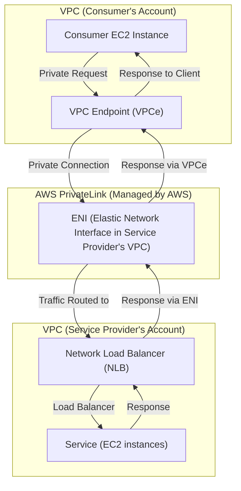

# AWS PrivateLink

This project demonstrates how to set up **AWS PrivateLink** using **Terraform**. It connects two VPCs in different AWS accounts: a **Service Provider** VPC and a **Consumer** VPC. The **Consumer** uses a VPC Endpoint to privately connect to a service hosted by the **Service Provider** via AWS PrivateLink.

## Architecture Overview

- **Service Provider**: Hosts a service behind a **Network Load Balancer (NLB)**.
- **Consumer**: Uses an **Interface VPC Endpoint** to privately access the service hosted by the Service Provider.

## Diagram




### Components:

1. **Service Provider**:
   - **VPC**: Service Provider's VPC.
   - **Network Load Balancer (NLB)**: Balances traffic to service instances.
   - **EC2 Instances**: Act as the service endpoints behind the NLB.

2. **Consumer**:
   - **VPC**: Consumer's VPC.
   - **VPC Endpoint**: Connects to the Service Provider's NLB via AWS PrivateLink.
   - **EC2 Instance**: Accesses the Service Provider's service privately through the VPC Endpoint.

## Prerequisites

- **Terraform** installed on your machine (version 0.12+).
- **AWS CLI** installed and configured with appropriate credentials.
- **Two AWS Accounts**: One to act as the **Service Provider** and another as the **Consumer** (or use two VPCs in the same account).
- **An appropriate AMI ID** for the EC2 instances.

## Project Status

**Status**: 🚧 In Progress - Initial, not tested.

- ✅ **Service Provider VPC**: Pending.
- ✅ **Consumer VPC**: Pending.
- ⚠️ **PrivateLink Connection**: Pending.
- ⚠️ **Security Group Rules**: Ensure proper configuration for your use case.

## How to Use

### Step 1: Set Up the Service Provider

1. Go to the **`service-provider/`** directory.
2. Initialize Terraform:
   ```bash
   terraform init


